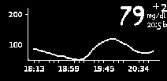
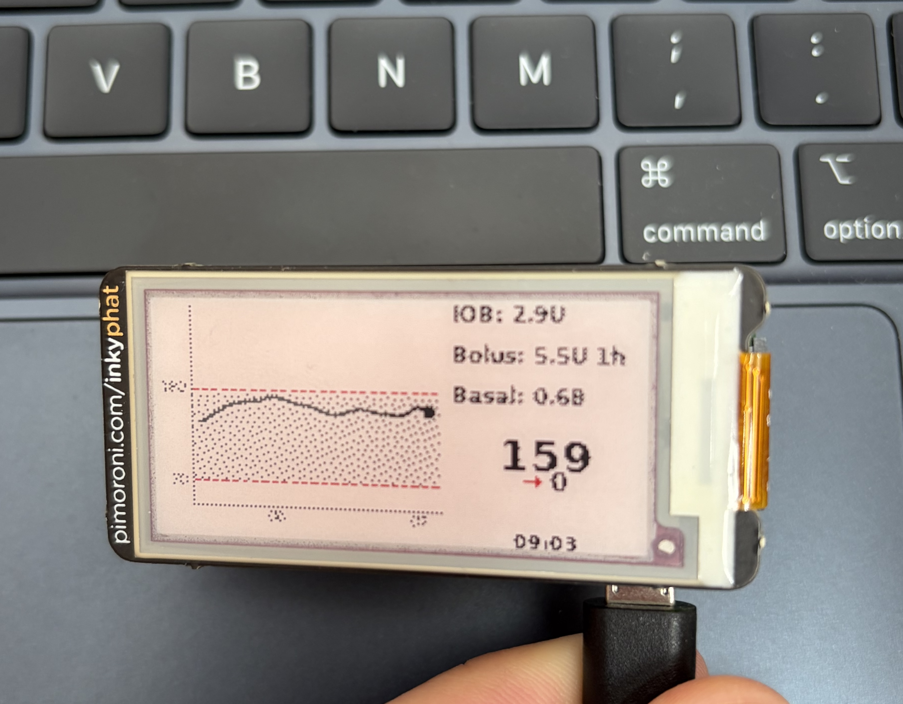

# inkyPhat_nightscout

A Python script that combines live glucose data from Dexcom with pump data from a Tandem t:slim X2 and renders both onto a Pimoroni [InkyPHAT](https://shop.pimoroni.com/products/inky-phat) mounted on a Raspberry Pi — no Nightscout instance required.

Data sources:

- **CGM:** Dexcom Share API directly, via [pydexcom](https://github.com/gagebenne/pydexcom). Real-time, no lag.
- **Pump:** Tandem Source API (the new platform replacing the legacy t:connect), via [tconnectsync](https://github.com/jwoglom/tconnectsync) used as a library. Provides current IOB, last bolus, and Control-IQ-adjusted basal rate (~5–15 min lag).

The live display shows the current reading + trend + 3h graph; whenever Tandem Source is reachable, a side panel adds IOB / last bolus / current basal. Outside work hours a suspend screen takes over: full-day graph + Time-in-Range stats, with a small ★ / ★★ / ★★★ trophy when TIR is good.




## What you need

- A Raspberry Pi with a GPIO header (Zero W / Zero 2 W / 3 / 4 are all fine)
- A Pimoroni InkyPHAT (red, yellow, or black/white)
- A Dexcom Share account (username + password)
- Optional: a Tandem Source account (`source.tandemdiabetes.com`) for pump data
- Python 3.11 or newer

## Setup on the Raspberry Pi

1. **Install InkyPHAT from Pimoroni:**

   ```bash
   git clone https://github.com/pimoroni/inky
   cd inky
   ./install.sh
   sudo apt install -y git python3-venv python3-dev libopenjp2-7 libopenblas0
   sudo reboot
   ```
   
   libopenblas0 is required by the numpy wheel — without it you'll see ImportError: libopenblas.so.0: cannot open shared object file when running the script.

2. **Clone the repo and create a virtualenv:**

   ```bash
   git clone https://github.com/thomaas/inkyPhat_nightscout.git
   cd inkyPhat_nightscout
   python3 -m venv .venv
   source .venv/bin/activate
   pip install -r requirements.txt
   pip install inky
   ```

   `inky` is the Pimoroni driver for the e-paper display. It's intentionally not in `requirements.txt` so the project can also be developed on a Mac.

3. **Create your config:**

   ```bash
   cp config.py_example config.py
   ```

   Edit `config.py` and fill in:
   - `dexcom_username` / `dexcom_password` — your Dexcom Share login
   - `dexcom_region` — `"us"` for the US, `"ous"` for the rest of the world, `"jp"` for Japan
   - `inkyPhatColour` — `"red"`, `"yellow"`, or `"black"`, matching your InkyPHAT model

4. **Run it:**

   ```bash
   python main.py
   ```

   The InkyPHAT will refresh and show your latest reading.

## Refreshing automatically

`main.py` renders the live screen; `suspend.py` renders a day-summary screen (full-day graph + Time-in-Range stats) that's intended to sit on the display outside working hours — e-paper keeps the image without power.

To run live every 5 minutes during weekday work hours and switch to the suspend screen at 17:00, add to `crontab -e` (adjust the paths to your home directory):

```cron
*/5 8-16 * * 1-5 /home/pi/inkyPhat_nightscout/.venv/bin/python /home/pi/inkyPhat_nightscout/main.py
0   17   * * 1-5 /home/pi/inkyPhat_nightscout/.venv/bin/python /home/pi/inkyPhat_nightscout/suspend.py
```

Set `checkDataBeforeRefresh = True` in `config.py` to skip the (relatively slow) e-paper refresh when there's no new reading from Dexcom.

## Development on a Mac (or any non-Pi machine)

The script also runs without an InkyPHAT — the Inky import is detected as missing and the rendered image is saved as a PNG instead, which is useful for tweaking the layout.

```bash
git clone https://github.com/thomaas/inkyPhat_nightscout.git
cd inkyPhat_nightscout
python3 -m venv .venv
source .venv/bin/activate
pip install -r requirements.txt
cp config.py_example config.py
```

In `config.py`, set `saveLastImageShown = True` so the preview PNG (`inkyPhatLastShown.png`) is written, then:

```bash
python main.py
```

## Tests

```bash
pip install pytest
python -m pytest tests/
```

The tests in `tests/dexcomCalls_test.py` are integration tests that hit the live Dexcom API, so they require valid credentials in `config.py` to pass.
