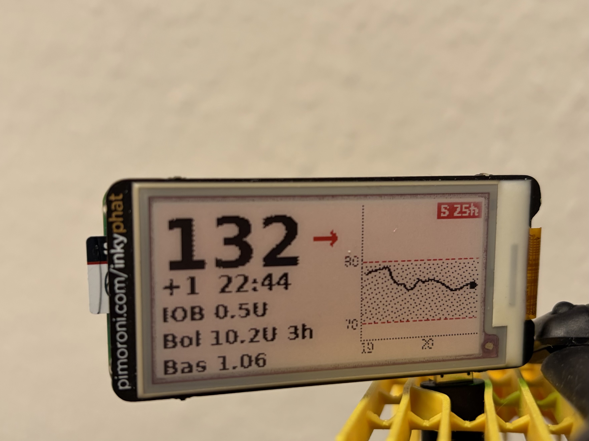
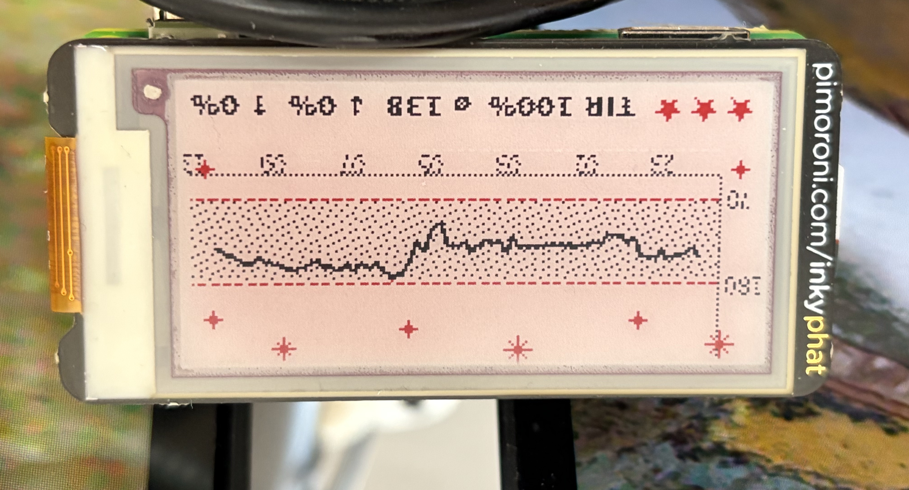

# inkyPhat_nightscout

A Python script that combines live glucose data from Dexcom with pump data from a Tandem t:slim X2 and renders both onto a Pimoroni [InkyPHAT](https://shop.pimoroni.com/products/inky-phat) mounted on a Raspberry Pi — no Nightscout instance required.

Data sources:

- **CGM:** Dexcom Share API directly, via [pydexcom](https://github.com/gagebenne/pydexcom). Real-time, no lag.
- **Pump:** Tandem Source API (the new platform replacing the legacy t:connect), via [tconnectsync](https://github.com/jwoglom/tconnectsync) used as a library. Provides current IOB, last bolus, and Control-IQ-adjusted basal rate (~5–15 min lag).

The live display shows the current reading + trend + 3h graph; whenever Tandem Source is reachable, a side panel adds IOB / last bolus / current basal. Outside work hours a suspend screen takes over: full-day graph + Time-in-Range stats, with a small ★ / ★★ / ★★★ trophy when TIR is good.




## What you need

- A Raspberry Pi with a GPIO header (Zero W / Zero 2 W / 3 / 4 are all fine)
- A Pimoroni InkyPHAT (red, yellow, or black/white)
- A Dexcom Share account (username + password)
- Optional: a Tandem Source account (`source.tandemdiabetes.com`) for pump data
- Python 3.11 or newer

## Setup on the Raspberry Pi

The order below matters: the project venv is created *before* the Pimoroni installer runs, so the `inky` driver is installed straight into that venv, and the single reboot comes last, after everything that touches `/boot/firmware/config.txt`.

1. **Install the system packages:**

   ```bash
   sudo apt update
   sudo apt install -y git python3-venv python3-dev \
       libopenjp2-7 libopenblas0 libfreetype6 libjpeg62-turbo
   ```

   `libopenblas0` is required by the numpy wheel — without it you'll see `ImportError: libopenblas.so.0: cannot open shared object file` when running the script. `libfreetype6` is what Pillow needs for text rendering: on Raspberry Pi OS, `pip` pulls Pillow from piwheels, and those wheels link against the *system* freetype instead of bundling their own — without it every `ImageFont.truetype()` call fails with `ImportError: libfreetype.so.6: cannot open shared object file`. `libopenjp2-7` and `libjpeg62-turbo` cover Pillow's other image codecs, `python3-dev` is for building wheels.

   No font files need to be installed: the display uses `DejaVuSans-Bold.ttf`, which ships inside the matplotlib package (`mpl-data/fonts/ttf/`). Only the freetype *runtime* above is required to rasterise it.

2. **Clone this repo and create the virtualenv:**

   ```bash
   git clone https://github.com/thomaas/inkyPhat_nightscout.git
   cd inkyPhat_nightscout
   python3 -m venv .venv
   source .venv/bin/activate
   ```

   Keep this venv activated for the next two steps.

3. **Install the Pimoroni Inky driver into the activated venv:**

   ```bash
   git clone https://github.com/pimoroni/inky ~/inky
   cd ~/inky
   ./install.sh
   ```

   The `cd` is required — `install.sh` reads `pyproject.toml` and `requirements.txt` from the current directory, so it has to be started from inside the `inky` clone (never from this project's folder, which has its own `pyproject.toml`).

   `install.sh` detects the activated `VIRTUAL_ENV` and installs `inky` there instead of creating its own `~/.virtualenvs/pimoroni`. It also installs the apt packages it needs and enables SPI / adds `dtoverlay=spi0-0cs` in `/boot/firmware/config.txt`. Answer its prompts, but **don't reboot yet** — that happens in step 6. Run it as your normal user, not with `sudo`.

   `inky` is deliberately not in `requirements.txt` (it needs GPIO/SPI), so the project can also be developed on a Mac. If you'd rather skip `install.sh`, the manual equivalent is:

   ```bash
   sudo raspi-config nonint do_spi 0
   sudo raspi-config nonint do_i2c 0
   echo "dtoverlay=spi0-0cs" | sudo tee -a /boot/firmware/config.txt
   pip install inky
   ```

4. **Install the project dependencies:**

   ```bash
   cd ~/inkyPhat_nightscout
   pip install -r requirements.txt
   ```

5. **Create your config:**

   ```bash
   cp config.py_example config.py
   ```

   Edit `config.py` and fill in:
   - `dexcom_username` / `dexcom_password` — your Dexcom Share login
   - `dexcom_region` — `"us"` for the US, `"ous"` for the rest of the world, `"jp"` for Japan
   - `dexcom_timezone_name` — IANA timezone for local-time display, e.g. `"Europe/Berlin"`
   - `inkyPhatColour` — `"red"`, `"yellow"`, or `"black"`, matching your InkyPHAT model
   - Optional, for pump data: `show_pump_data = True` plus `tconnect_email` / `tconnect_password` / `tconnect_region` (`"US"` or `"EU"`)

6. **Reboot so the SPI changes take effect:**

   ```bash
   sudo reboot
   ```

7. **Run it:**

   ```bash
   cd ~/inkyPhat_nightscout
   source .venv/bin/activate
   python main.py
   ```

   The InkyPHAT will refresh and show your latest reading. (The reboot dropped the venv activation, hence the `source` again — cron uses the venv's Python directly, see below.)

## Refreshing automatically

`main.py` renders the live screen; `suspend.py` renders a day-summary screen (full-day graph + Time-in-Range stats) that's intended to sit on the display outside working hours — e-paper keeps the image without power.

To run live every 5 minutes during weekday work hours and switch to the suspend screen at 17:00, add to `crontab -e` (adjust the paths to your home directory):

```cron
*/5 8-16 * * 1-5 /home/pi/inkyPhat_nightscout/.venv/bin/python /home/pi/inkyPhat_nightscout/main.py
0   17   * * 1-5 /home/pi/inkyPhat_nightscout/.venv/bin/python /home/pi/inkyPhat_nightscout/suspend.py
```

Set `checkDataBeforeRefresh = True` in `config.py` to skip the (relatively slow) e-paper refresh when there's no new reading from Dexcom.

## Development on a Mac (or any non-Pi machine)

The script also runs without an InkyPHAT — the Inky import is detected as missing and the rendered image is saved as a PNG instead, which is useful for tweaking the layout.

```bash
git clone https://github.com/thomaas/inkyPhat_nightscout.git
cd inkyPhat_nightscout
python3 -m venv .venv
source .venv/bin/activate
pip install -r requirements.txt
cp config.py_example config.py
```

In `config.py`, set `saveLastImageShown = True` so the preview PNG (`inkyPhatLastShown.png`) is written, then:

```bash
python main.py
```

## Troubleshooting

**`ImportError: libfreetype.so.6: cannot open shared object file`** (raised from `PIL/ImageFont.py`)

The system freetype library is missing, so Pillow can't rasterise any text:

```bash
sudo apt install -y libfreetype6
.venv/bin/python -c "from PIL import ImageFont; print(ImageFont.core)"
```

If it still fails afterwards, reinstall Pillow from PyPI so you get a wheel with freetype bundled instead of the piwheels build:

```bash
.venv/bin/pip install --force-reinstall --no-cache-dir \
    --index-url https://pypi.org/simple Pillow
```

The same pattern applies to `libopenblas.so.0` (numpy) — see step 1 for the full package list.

**`Tandem API not available: …`** (e.g. `'TandemSourceApi' object has no attribute 'get_pumper'`)

Your `tconnectsync` predates 3.0. Tandem replaced the binary event stream with pre-decoded JSON endpoints, and `tandemCalls.py` targets that new API (`get_pumper()` / `get_pump_logs()`, camelCase event fields). The pump panel is skipped and the rest of the display still renders; to get pump data back:

```bash
.venv/bin/pip install -U "tconnectsync>=3.0,<4"
```

## Tests

```bash
pip install pytest
python -m pytest tests/
```

The tests in `tests/dexcomCalls_test.py` are integration tests that hit the live Dexcom API, so they require valid credentials in `config.py` to pass.
